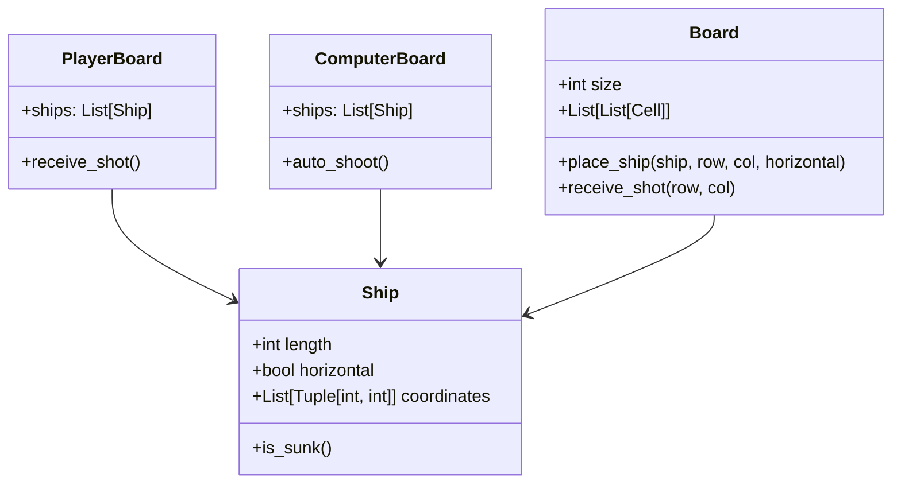

# Battleship (Gra w statki)

Tekstowa gra w statki: gracz vs komputer.

Rozgrywka odbywa się na dwóch planszach:
- Twoja plansza: zawiera Twoje statki i trafienia komputera.
- Plansza przeciwnika (komputera): pokazuje tylko trafienia dokonane przez Ciebie.

Każdy gracz ma 3 statki o długościach 2, 3 i 4 pola, rozmieszczone losowo.

---

## Uruchomienie gry

### Krok 1: Stwórz i aktywuj środowisko wirtualne

```bash
python -m venv venv

# Windows PowerShell
.env\Scripts\Activate.ps1

# Windows CMD
.env\Scriptsctivate.bat

# Linux / macOS
source venv/bin/activate
```

### Krok 2: Zainstaluj wymagania

```bash
pip install -r requirements.txt
```

### Krok 3: Uruchom grę

```bash
python -m src.ui
```

---

## Testowanie

Projekt zawiera testy jednostkowe i funkcjonalne:

```bash
pytest
```

Aby sprawdzić jakość kodu:

```bash
flake8 src tests
```

---


## Wygenerowany wykres

Po zakończeniu rozgrywki generowany jest wykres liczby trafień na turę:

Plik wyjściowy: `reports/hits.png`

---

## Diagram klas



---

